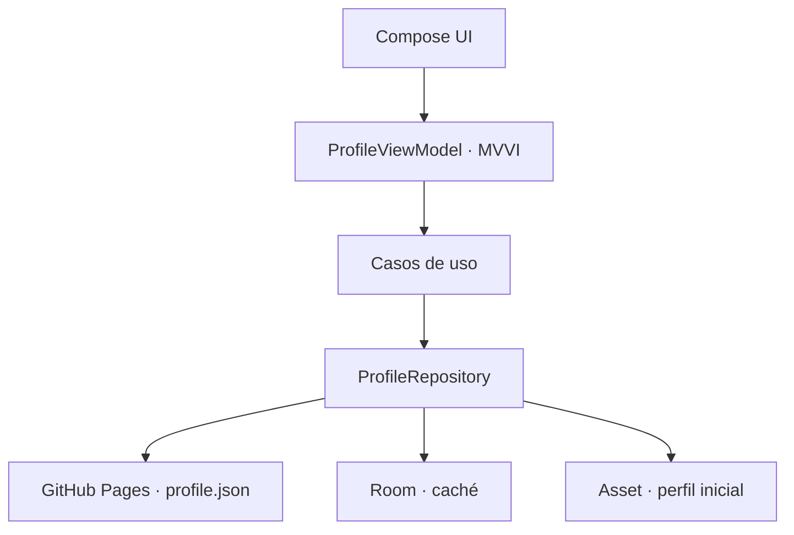
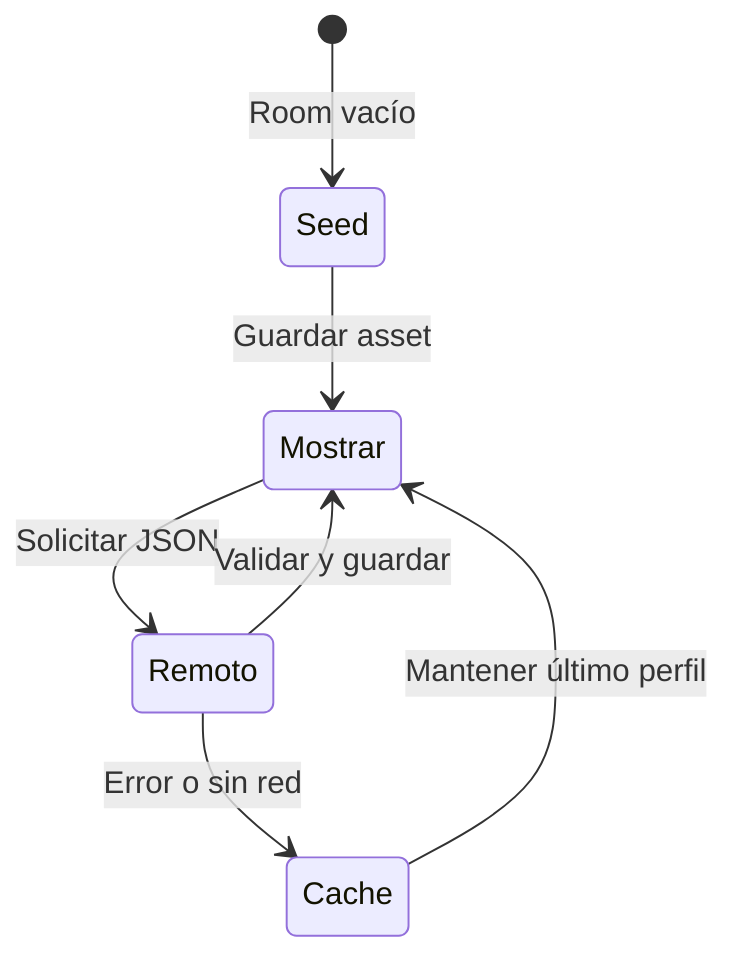

# Arquitectura

La app aplica Clean Architecture modular y un flujo MVVI unidireccional. La UI no conoce Retrofit, Room ni los DTOs.

## MVVI

- `ProfileIntent`: acciones del usuario.
- `ProfileUiState`: estado inmutable que renderiza Compose.
- `ProfileEffect`: eventos de una sola ejecución, como abrir una URL o compartir.
- `ProfileViewModel`: reduce intents a estado y efectos.
- `BaseViewModel<I, S, E>`: base común con `StateFlow` y `Channel`.

Compose envía intents y observa el estado con ciclo de vida. Los efectos quedan fuera del estado persistente para que no se repitan tras una recomposición.

## Fuente única y estrategia de datos

Room es la fuente observable para la UI. El repositorio sigue estas reglas:

El registro `ProfileEntity` conserva el JSON completo, la fecha editorial y el instante de caché. Esta decisión mantiene flexible el perfil público: añadir listas o textos no obliga a crear numerosas tablas relacionales para un único documento profesional.

## Validación remota

Antes de guardar una respuesta se comprueba:

- `schemaVersion >= 1`.
- Nombre profesional no vacío.
- URL de la web con HTTPS.

Una respuesta inválida no sustituye la última copia correcta.

## Inyección de dependencias

Koin se inicia en `DigitalPortfolioApplication`.

- `appModule`: Moshi, Retrofit API, Room, DAO, repositorio y casos de uso.
- `profileFeatureModule`: `ProfileViewModel`.

## Diseño adaptable

`ProfileFeatureApp` decide la navegación según el ancho disponible:

- Compacto: navegación inferior.
- Pantallas amplias: `NavigationRail` y contenido centrado.
- Tarjeta profesional: composición vertical u horizontal según restricciones.
- Listas y proyectos: rejilla adaptativa en pantallas con espacio suficiente.

## Decisiones de seguridad

- Solo tráfico HTTPS (`usesCleartextTraffic=false`).
- No hay claves API ni autenticación embebida.
- El QR se genera localmente con ZXing.
- El contenido remoto se valida antes de persistir.
- GitHub REST API no forma parte del camino de ejecución.

